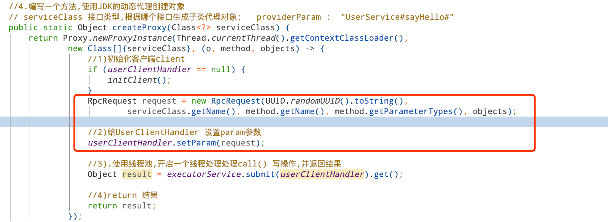
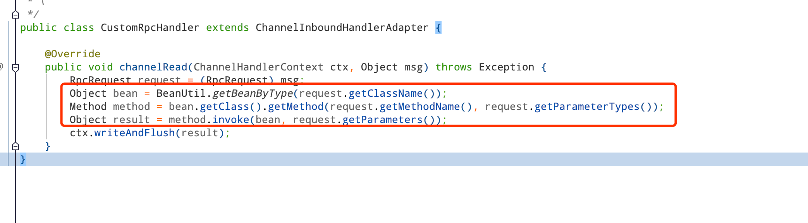

### 1.创建编码器&解码器


**编码器**

```java
package com.lagou.nettyrpc.server.coder;

import io.netty.buffer.ByteBuf;
import io.netty.channel.ChannelHandlerContext;
import io.netty.handler.codec.MessageToByteEncoder;

/**
 * \* User: ZhuFangTao
 * \* Date: 2020/6/17 2:40 下午
 * \
 */
public class RpcEncoder extends MessageToByteEncoder {

    private Serializer serializer;

    public RpcEncoder(Serializer serializer) {
        this.serializer = serializer;
    }

    @Override
    protected void encode(ChannelHandlerContext ctx, Object msg, ByteBuf byteBuf) throws Exception {
        byte[] bytes = serializer.serialize(msg);
        byteBuf.writeInt(bytes.length);
        byteBuf.writeBytes(bytes);
    }
}
```

**解码器：**

```java
package com.lagou.nettyrpc.server.coder;

import io.netty.buffer.ByteBuf;
import io.netty.channel.ChannelHandlerContext;
import io.netty.handler.codec.ByteToMessageDecoder;

import java.util.List;

/**
 * \* User: ZhuFangTao
 * \* Date: 2020/6/17 2:40 下午
 * \
 */
public class RpcDecoder<T> extends ByteToMessageDecoder {

    private Class clazz;
    private Serializer serializer;

    public RpcDecoder(Class<T> clazz, Serializer serializer) {
        this.clazz = clazz;
        this.serializer = serializer;
    }

    @Override
    protected void decode(ChannelHandlerContext ctx, ByteBuf in, List<Object> out) throws Exception {
        if (clazz != null) {
            if (in.readableBytes() < 4) { //首先读取 int类型的长度 byteBuf.writeInt(bytes.length);
                return;
            }
            in.markReaderIndex();
            //读取消息长度
            int msgLength = in.readInt();
            //做readindex
            int length = in.readableBytes();
            if (length < msgLength) {
                in.resetReaderIndex();
                return;
            }
            byte[] bytes = new byte[msgLength];
            in.readBytes(bytes);

            //反序列化对象
            Object object = serializer.deserialize(clazz, bytes);
            out.add(object);
        }
    }
}
```


### 2.创建RpcRequest对象


```java
public class RpcRequest {

    /**
     * 请求对象的ID
     */
    private String requestId;

    /**
     * 类名
     */
    private String className;

    /**
     * 方法名
     */
    private String methodName;

    /**
     * 参数类型
     */
    private Class<?>[] parameterTypes;

    /**
     * 入参
     */
    private Object[] parameters;
  }
```


### 3.服务器ChannelHandle添加RpcDecoder解码器

```java
pipeline.addLast(new RpcDecoder(RpcRequest.class, new JsonSerializer()));
```


### 4.客户端ChannelHandle 添加RpcEncoder编码器

```java
pipeline.addLast(new RpcEncoder(new JsonSerializer()));
```


### 5.创建bean获取工具类BeanUtil

```java
@Component
public class BeanUtil implements ApplicationContextAware {

    private static ApplicationContext applicationContext;

    public static Object getBeanByType(String className) throws ClassNotFoundException {
        return applicationContext.getBean(Class.forName(className));
    }

    public void setApplicationContext(ApplicationContext arg0) {
        applicationContext = arg0;
    }

    public static Object getBean(String beanName){
        return applicationContext.getBean(beanName);
    }

}
```


### 6.客户端请求使用封装RpcRequest




### 7.服务器端获取RpcRequest 并调用相关方法

